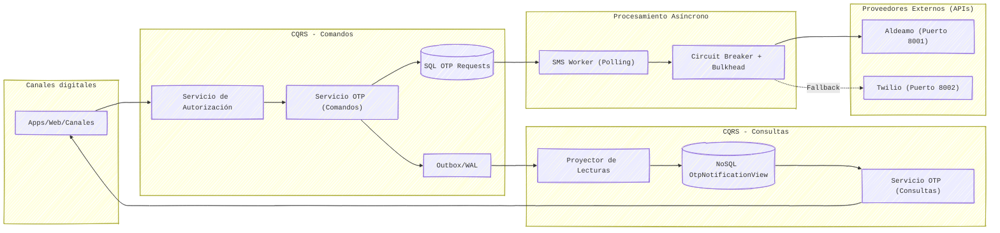

# OTP CQRS — Sistema de Notificaciones

Prototipo que demuestra patrones de diseño empresariales en Django:
**CQRS**, **Outbox/WAL**, **Procesamiento Asíncrono (Worker)**, **Circuit Breaker + Bulkhead**, **Microservicios** y **dual-database (SQL + MongoDB)**.

## Arquitectura



## Patrones Implementados

| Patrón | Implementación |
|--------|---------------|
| CQRS | Command Service escribe en SQL; Query Service lee de MongoDB de forma optimizada |
| Procesamiento Asíncrono | `SMS Worker` lee en background los eventos `PENDING` para no bloquear el request |
| Outbox/WAL | `OutboxEvent` escrito atómicamente con `OtpRequest` en SQL |
| Consistencia Eventual | `Outbox Projector` sincroniza los eventos desde SQL hacia MongoDB asíncronamente |
| Circuit Breaker | `pybreaker` envolviendo llamadas a microservicios; fallback automático a Twilio si Aldeamo cae |
| Bulkhead | `threading.Semaphore` limitando concurrencia por proveedor para evitar agotamiento de recursos |
| Microservicios | Aldeamo y Twilio extraídos a servidores web independientes (Puertos 8001 y 8002) |
| Dual DB | SQLite (Transactional Write-side) + MongoDB (Read-side optimizado) |

## Instalación

```bash
pip install -r requirements.txt
python manage.py migrate
```

Asegúrate de tener MongoDB ejecutándose localmente en el puerto `27017` (sin autenticación).

## Uso

### 1. Iniciar Microservicios Externos (Terminales separadas)

Inicia los simuladores de los proveedores externos en puertos independientes:

```bash
python services/aldeamo/main.py   # Puerto 8001
python services/twilio/main.py    # Puerto 8002
```

### 2. Iniciar Core (Django + Projector + Worker)

Puedes iniciar todos los componentes internos con un solo comando:

```bash
python manage.py run_all
```
*(Esto levantará el Servidor Web en 8000, el Proyector CQRS y el SMS Worker en hilos de fondo).*

### 3. Dashboard

Abre en tu navegador: http://localhost:8000/dashboard/

## API REST

#### Obtener token JWT
```bash
curl -X POST http://localhost:8000/api/auth/token/ \
  -H "Content-Type: application/json" \
  -d '{"client_id": "demo", "client_secret": "demo"}'
```

#### Enviar OTP (Comando Asíncrono)
```bash
curl -X POST http://localhost:8000/api/otp/send/ \
  -H "Authorization: Bearer <TOKEN>" \
  -H "Content-Type: application/json" \
  -d '{"phone_number": "+573001234567"}'
```
*(Retornará `202 ACCEPTED` inmediatamente)*

#### Consultar OTPs (Consultas Rápidas en MongoDB)
```bash
curl http://localhost:8000/api/otp/ \
  -H "Authorization: Bearer <TOKEN>"
```

#### Estado Circuit Breaker
```bash
curl http://localhost:8000/api/system/circuit-breaker/ \
  -H "Authorization: Bearer <TOKEN>"
```

#### Estadísticas CQRS Outbox
```bash
curl http://localhost:8000/api/system/outbox/ \
  -H "Authorization: Bearer <TOKEN>"
```

## Demostrar el Circuit Breaker

1. Usa el panel de **"Simulador de Tráfico"** en el Dashboard para enviar "5 OTPs".
2. Si un microservicio (ej. Aldeamo) falla 3 veces consecutivas, su Circuit Breaker cambiará de estado `CLOSED` a `OPEN`.
3. Verás en vivo cómo los envíos usan automáticamente Twilio (`Fallback`).
4. Después de 30 segundos, el circuito pasará a `HALF_OPEN` e intentará enviar un mensaje a Aldeamo nuevamente para probar si ya se recuperó.

## Estructura del Proyecto

```text
Patrones/
├── manage.py
├── requirements.txt
├── parcial/
│   ├── settings.py         ← Configuración central
│   └── templates/
│       └── dashboard.html  ← Dashboard de monitoreo interactivo
├── otp/                    ← Motor principal del banco (Sentinel)
│   ├── models.py           ← Modelos SQL
│   ├── mongo.py            ← Conexión MongoDB
│   ├── views.py            ← REST API endpoints
│   ├── services/
│   │   ├── command_service.py  ← CQRS Write (Asíncrono)
│   │   ├── query_service.py    ← CQRS Read (MongoDB)
│   │   ├── sms_gateway.py      ← HTTP Clients, Circuit Breaker + Bulkhead
│   │   ├── sms_worker.py       ← Procesamiento background (Polling)
│   │   └── projector.py        ← Sincronizador SQL → MongoDB
│   └── management/commands/
│       └── run_all.py      ← Comando unificado de arranque
└── services/               ← Microservicios externos
    ├── aldeamo/
    │   └── main.py         ← API en puerto 8001
    └── twilio/
        └── main.py         ← API en puerto 8002
```
