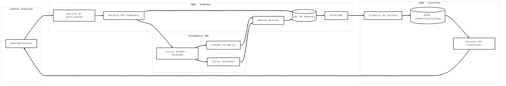

# OTP CQRS — Sistema de Notificaciones

Prototipo que demuestra patrones de diseño empresariales en Django:
**CQRS**, **Outbox/WAL**, **Circuit Breaker + Bulkhead**, y **dual-database (SQL + MongoDB)**.

## Arquitectura



## Patrones Implementados

| Patrón | Implementación |
|--------|---------------|
| CQRS | Command Service escribe SQL; Query Service lee MongoDB |
| Outbox/WAL | `OutboxEvent` escrito atómicamente con `OtpRequest` |
| Projection | `run_projector` polling → upsert MongoDB |
| Circuit Breaker | `pybreaker` wrapping Aldeamo; fallback a Twilio |
| Bulkhead | `threading.Semaphore` por proveedor |
| JWT Auth | `PyJWT` + DRF authentication class |
| Dual DB | SQLite (write side) + MongoDB (read side) |

## Instalación

```bash
pip install -r requirements.txt
python manage.py migrate
```

## Uso

### 1. Iniciar el servidor Django

```bash
python manage.py runserver
```

### 2. Iniciar el Proyector Outbox (terminal separada)

```bash
python manage.py run_projector
# o con intervalo personalizado:
python manage.py run_projector --interval 5
```

### 3. Dashboard

Abre: http://localhost:8000/dashboard/

### 4. API REST

#### Obtener token JWT
```bash
curl -X POST http://localhost:8000/api/auth/token/ \
  -H "Content-Type: application/json" \
  -d '{"client_id": "demo", "client_secret": "demo"}'
```

#### Enviar OTP (Comando)
```bash
curl -X POST http://localhost:8000/api/otp/send/ \
  -H "Authorization: Bearer <TOKEN>" \
  -H "Content-Type: application/json" \
  -d '{"phone_number": "+573001234567"}'
```

#### Consultar OTPs (lee MongoDB)
```bash
curl http://localhost:8000/api/otp/ \
  -H "Authorization: Bearer <TOKEN>"
```

#### Estado Circuit Breaker
```bash
curl http://localhost:8000/api/system/circuit-breaker/ \
  -H "Authorization: Bearer <TOKEN>"
```

#### Estadísticas Outbox
```bash
curl http://localhost:8000/api/system/outbox/ \
  -H "Authorization: Bearer <TOKEN>"
```

## Clientes JWT predefinidos

| client_id | client_secret |
|-----------|--------------|
| app_web | secret_web_123 |
| app_mobile | secret_mobile_456 |
| demo | demo |

## Configuración (parcial/settings.py)

| Setting | Default | Descripción |
|---------|---------|-------------|
| `MONGODB_URI` | mongodb://localhost:27017 | Conexión MongoDB |
| `MONGODB_DB_NAME` | otp_cqrs | Base de datos MongoDB |
| `ALDEAMO_FAILURE_RATE` | 0.3 | Tasa de fallo Aldeamo (0.0-1.0) |
| `TWILIO_FAILURE_RATE` | 0.05 | Tasa de fallo Twilio (0.0-1.0) |
| `CIRCUIT_BREAKER_FAIL_MAX` | 3 | Fallos antes de abrir el circuito |
| `CIRCUIT_BREAKER_RESET_TIMEOUT` | 30 | Segundos antes de half-open |
| `JWT_EXPIRY_SECONDS` | 3600 | TTL del token JWT |

## Demostrar el Circuit Breaker

1. Cambiar `ALDEAMO_FAILURE_RATE = 1.0` en settings.py
2. Enviar múltiples OTPs desde el dashboard (botón "Estrés: 20 OTPs")
3. Observar el Circuit Breaker de Aldeamo cambiar de CLOSED → OPEN
4. Ver que los envíos usan automáticamente Twilio como fallback
5. Después de 30s, el circuito pasa a HALF_OPEN y vuelve a intentar Aldeamo

## Estructura del Proyecto

```
Patrones/
├── manage.py
├── requirements.txt
├── test_integration.py     ← Suite de pruebas
├── test_projector.py       ← Test del proyector
├── parcial/
│   ├── settings.py         ← Configuración central
│   ├── urls.py
│   └── templates/
│       └── dashboard.html  ← Dashboard de monitoreo
├── otp/                    ← Motor CQRS principal
│   ├── models.py           ← OtpRequest, OutboxEvent, CircuitBreakerState
│   ├── admin.py
│   ├── auth.py             ← Servicio JWT
│   ├── mongo.py            ← Conexión MongoDB
│   ├── views.py            ← REST API endpoints
│   ├── urls.py
│   ├── serializers.py
│   ├── dashboard_views.py
│   ├── dashboard_urls.py
│   ├── services/
│   │   ├── command_service.py  ← Escribe SQL + Outbox
│   │   ├── query_service.py    ← Lee MongoDB
│   │   ├── sms_gateway.py      ← Circuit Breaker + Bulkhead
│   │   └── projector.py        ← Outbox → MongoDB
│   └── management/
│       └── commands/
│           └── run_projector.py
├── aldeamo/
│   └── adapter.py          ← Mock Aldeamo (30% fallo)
└── twilio/
    └── adapter.py          ← Mock Twilio (5% fallo, fallback)
```
